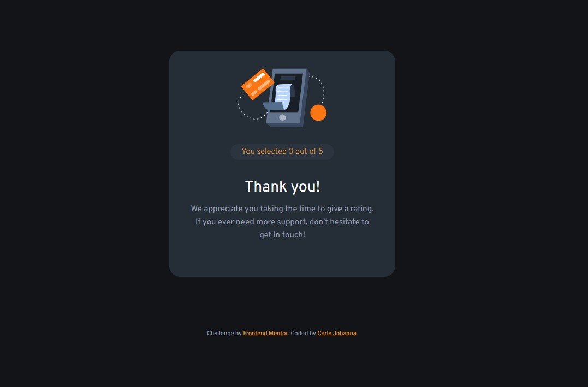

# Frontend Mentor - Interactive rating component solution

This is a solution to the [Interactive rating component challenge on Frontend Mentor](https://www.frontendmentor.io/challenges/interactive-rating-component-koxpeBUmI). Frontend Mentor challenges help you improve your coding skills by building realistic projects. 

## Table of contents

- [Frontend Mentor - Interactive rating component solution](#frontend-mentor---interactive-rating-component-solution)
  - [Table of contents](#table-of-contents)
  - [Overview](#overview)
    - [The challenge](#the-challenge)
    - [Screenshot](#screenshot)
    - [Links](#links)
  - [My process](#my-process)
    - [Built with](#built-with)
    - [What I learned](#what-i-learned)
    - [Continued development](#continued-development)
    - [Useful resources](#useful-resources)
  - [Author](#author)
  - [Acknowledgments](#acknowledgments)

## Overview

### The challenge

Users should be able to:

- View the optimal layout for the app depending on their device's screen size
- See hover states for all interactive elements on the page
- Select and submit a number rating
- See the "Thank you" card state after submitting a rating

### Screenshot

### Links

- Solution URL: [Code](https://github.com/devcjoha/Interactive-rating-component)
- Website URL: [Deploy] [here](https://interactive-rating-frontendm.netlify.app/)

## My process

### Built with

### What I learned

This project served as an excellent practical lesson on the relationship between HTML, CSS, and pure JavaScript for handling UI state. The main learnings involved debugging common DOM manipulation errors and understanding selector efficiency.

1. Correctly Accessing Data from HTML
The biggest challenge was reliably extracting the selected rating value from the button, which was solved by understanding the difference between standard properties and custom data attributes.

2. Managing Exclusive State with classList
To ensure only one rating button could be selected at a time, I implemented the clean pattern of iterating and removing the active class from all buttons before adding it to the clicked element.

3. Resolving CSS Specificity for State Transitions
I learned that sometimes a simple display: none; isn't strong enough to override base rules like display: flex;. Using the !important rule in the utility class guaranteed the visual transition between the rating and thank-you states.

### Continued development

In future projects, I want to focus on:

Refactoring DOM Access: Structuring the JavaScript code to prevent potential null errors when accessing DOM elements, ensuring better code robustness.

Introducing a Framework: Applying the same state management logic (like selecting a rating and managing a global state) within a JavaScript library like React to understand how frameworks simplify the DOM manipulation process.

Improved Form Validation: Using native HTML validation features instead of a simple JavaScript alert() for better user experience.

### Useful resources

- Essential resource for understanding event handling and the difference between e and e.target.

- Helped clarify the best way to handle element state via CSS classes.

## Author

- Website - [Carla Johanna](https://github.com/devcjoha)
- Frontend Mentor - [@devcjoha](https://www.frontendmentor.io/profile/yourusername)
- X - [@CarlitaJohanna](https://www.x.com/carlitajohana)

## Acknowledgments

I'd like to extend a special thanks to my IA assistant for the detailed guidance on debugging common errors like incorrect selectors (.rating.btn vs .rating-btn), the e.target.value vs. e.target.dataset.value issue, and the necessary use of !important in the CSS visibility class. These explanations were crucial for completing the project successfully.
